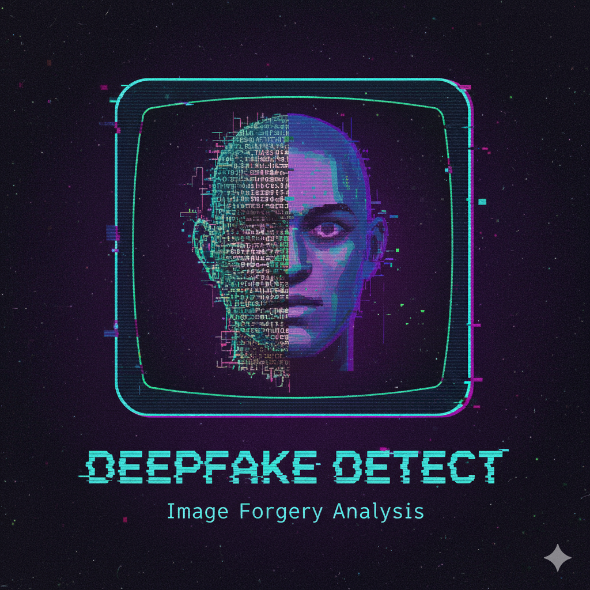

# AI? CGI? DEEPFAKE? Digital Forensics in Images: Detection of CGIs and Deepfakes in digital images 🕵️

**Digital forensics** in visual media is the science of uncovering traces left by image acquisition devices or manipulation software. Detecting fakes relies on the fact that every step in the imaging pipeline—from the camera sensor to the final software edit—leaves a unique statistical or physical artifact.

## Deepfake Detection

**Deepfakes** are highly realistic synthetic media generated using **deep learning models**, primarily **Generative Adversarial Networks (GANs)**. The main detection strategies exploit flaws in how AI recreates complex human physiology and the physical environment:

### A. Physiological Inconsistencies
AI often struggles with complex or small human features. Forensic analysis looks for discrepancies in:
* **Eye Blinking:** Deepfakes may exhibit unnatural, absent, or inconsistent blinking patterns because AI training data often lacks images of eyes closed.
* **Anatomy:** Imperfections in rendering **hands, ears, teeth, or hair** can expose a deepfake.
* **Biological Signals:** Analyzing subtle skin color changes (via remote **Photoplethysmography** or **rPPG**) can detect inconsistencies in the synthesized person's simulated heart rate, a feature AI often fails to perfectly replicate.

### B. Environmental Inconsistencies
* **Lighting and Shadows:** When a forged face is spliced onto a new scene, the light intensity, direction, or corresponding shadows on the face may not align with the rest of the image.

### C. Statistical Artifacts
* Advanced detection uses **Convolutional Neural Networks (CNNs)** or **Vision Transformers** to analyze invisible statistical **fingerprints** left behind by the specific generative model (GAN or Diffusion Model) used to create the fake.

***

## CGI and General Forgery Detection

General image manipulation, including splicing (copy-paste) or **Computer-Generated Imagery (CGI)** insertion, is detected by examining low-level artifacts:

* **Noise Analysis (PRNU):** Every digital camera sensor has a unique microscopic pattern noise called **Photo-Response Non-Uniformity (PRNU)**. This is a unique "fingerprint." If a region of an image has a PRNU pattern that is different from the rest of the photo, it is likely a spliced or inserted fake.
* **Error Level Analysis (ELA):** ELA highlights areas of an image that have a different level of JPEG compression history. Spliced-in content, not compressed as often as the original image, will often stand out with a much lower "error level."
* **Color Filter Array (CFA) Artifacts:** Digital cameras use a **CFA** (e.g., Bayer filter) to capture color and then use a process called **demosaicing** to interpolate the full-color image. This process leaves a unique, periodic statistical pattern. Any manipulation disrupts this pattern, which can be detected.
* **Metadata (EXIF) Forensics:** Although metadata can be easily faked or stripped, the **Exchangeable Image File Format (EXIF)** can contain the camera model, date, time, and even the history of software used to process the file, providing initial clues.

## 🕵️ Different Ways to Detect CGI/Deepfakes in Digital Images

Professor Hany Farid's research focuses on exploiting the subtle physical and statistical inconsistencies that human eyes miss but that digital analysis can uncover in manipulated or computer-generated imagery.

Here are four distinct detection methods and the core reasoning behind them:

---

### 1. Physics-Based Lighting and Geometry Inconsistencies

This method verifies an image's integrity against the laws of **physics**.

| Aspect Detected | Reasoning/Thought Process |
| :--- | :--- |
| **Inconsistent Lighting** | In a real photograph, every object is illuminated by the same light source(s). When a person or object is digitally inserted (a forgery/deepfake), it is extremely difficult to match the light direction, color, and intensity perfectly to the background scene. |
| **Specular Highlights/Shadows** | The analysis focuses on cues like the geometry of shadows or the position of reflections (specular highlights) on glossy surfaces (like the eye). If the light source implied by a shadow does not match the light source implied by the reflection, the image is likely a composite. |

---

### 2. Digital Fingerprints (JPEG Quantization & Re-sampling)

This method focuses on identifying residual **artifacts** that reveal an image's processing history.

| Aspect Detected | Reasoning/Thought Process |
| :--- | :--- |
| **Re-sampling Traces** | When an image is manipulated (resized, rotated, or warped), the software must **interpolate** (re-sample) pixels. This process leaves behind faint, periodic statistical correlations in the pixel data that differ from a pristine original, signaling manipulation. |
| **JPEG Quantization Discrepancies** | Every time an image is saved in a lossy format like JPEG, a specific compression pattern (**quantization**) is applied. A pasted element often comes from a source that was compressed differently, resulting in an area that exhibits **double-quantization** (two compression grids) which is statistically inconsistent with the rest of the image. |

---

### 3. Camera Sensor Artifacts (Color Filter Array - CFA)

This method leverages the unique way a digital camera's sensor captures color information, creating a **sensor fingerprint**.

| Aspect Detected | Reasoning/Thought Process |
| :--- | :--- |
| **Disrupted CFA Pattern** | Most digital cameras use a Color Filter Array (CFA) that requires mathematical interpolation (**demosaicing**) to create a full-color image. This interpolation introduces a predictable, periodic correlation pattern between neighboring pixels. |
| **Bypassing the Camera Pipeline** | When a deepfake or manipulated region is created by an algorithm, it bypasses the physical camera capture and interpolation process. The synthetic region will either lack this expected CFA correlation pattern or have an inconsistent one, clearly marking it as non-original to the source image. |

---

### 4. Higher-Order Statistical Analysis

This is a powerful technique for distinguishing between statistically "natural" images and statistically "unnatural" synthetic images.

| Aspect Detected | Reasoning/Thought Process |
| :--- | :--- |
| **Statistical Model Deviations** | While deepfakes look visually realistic, Generative AI models often fail to perfectly replicate the complex, non-linear dependencies between pixels found in real, natural images. |
| **Wavelet Analysis (HOS)** | Analysis is often performed using **Higher-Order Statistics (HOS)** in the wavelet domain. A **real photograph**'s statistical distributions conform to known mathematical models for natural scenes. A **synthetic image** exhibits subtle, systematic statistical deviations or "over-regularity" that flags it as algorithmically generated. |

#### Credits: Professor Hany Farid's research on digital image forensic - https://farid.berkeley.edu/
